<div align="center">

# ⚙️ Jino Sabu — Digital Architect Portfolio

### A futuristic, mobile-first portfolio engineered like a browser-native personal operating system.

<p>
  <a href="./index.html"></a>
  
  
  
</p>

<p>
  <b>Portfolio</b> · <b>Smart Toolkit</b> · <b>Local-first utilities</b> · <b>Canvas physics</b> · <b>Camera scanner</b> · <b>Mobile-first UX</b>
</p>

</div>

---

## ✨ Overview

This repository contains a highly interactive portfolio website for **Jino Sabu** — a Mechanical Engineer turned Frontend Developer / Digital Architect.

Unlike a normal portfolio, this project is designed as a **single-page digital workbench**. It combines personal branding, project showcase, creator storefront, browser-native tools, local data utilities, accessibility preferences, and polished mobile-first interactions in one handcrafted HTML experience.

> Built to feel less like a static resume and more like an engineered interface.

---

## 🚀 Live Features

<table>
  <tr>
    <td width="50%">
      <h3>🎛️ Digital Toolkit</h3>
      <ul>
        <li>Focus timer</li>
        <li>Daily mission planner</li>
        <li>Stopwatch</li>
        <li>Modern password generator</li>
        <li>Smart clipboard</li>
        <li>Counters</li>
        <li>QR generator</li>
        <li>Camera scanner</li>
        <li>Local data control center</li>
      </ul>
    </td>
    <td width="50%">
      <h3>🧠 Portfolio Experience</h3>
      <ul>
        <li>Canvas 2D physics hero</li>
        <li>Skill radar / engineering stack</li>
        <li>Outcome-based project filters</li>
        <li>Project case-study sheets</li>
        <li>Storefront product previews</li>
        <li>Tool of the day</li>
        <li>Visual table of contents</li>
        <li>Recent updates / changelog</li>
        <li>Telegram feedback flow</li>
      </ul>
    </td>
  </tr>
</table>

---

## 🧩 Interactive Elements

<details open>
<summary><b>📱 Mobile-first Bottom Sheets</b></summary>

The interface uses bottom-sheet navigation for search, notes, toolkit, appearance settings, product previews, and project case studies. This keeps the experience app-like on mobile while still working well on desktop.

</details>

<details>
<summary><b>⌨️ Command Palette</b></summary>

Open the command palette with:

<kbd>Ctrl</kbd> + <kbd>K</kbd> / <kbd>Cmd</kbd> + <kbd>K</kbd>

Suggested commands appear before typing, including:

- Open Toolkit
- Start Focus Timer
- Generate QR
- Open Projects
- Change Theme

</details>

<details>
<summary><b>📷 Camera Scanner</b></summary>

The scanner uses browser camera access via `getUserMedia()` and supports:

- QR scanning
- Barcode detection where the browser supports `BarcodeDetector`
- OCR through Tesseract.js
- Auto-copying scanned content into the Smart Clipboard

> Camera access requires HTTPS or localhost.

</details>

<details>
<summary><b>🧾 Local Data Control</b></summary>

All toolkit data is stored locally in the browser using `localStorage`.

Supported controls:

- Export notes
- Export clipboard
- Clear clipboard
- Clear tasks
- Clear passwords
- Clear all local data

No backend is required.

</details>

<details>
<summary><b>♿ Accessibility Preferences</b></summary>

The Appearance panel includes:

- Reduce motion
- High contrast
- Larger text
- Disable sounds

These preferences are saved locally.

</details>

---

## 🛠️ Tech Stack

| Layer | Technology |
|---|---|
| Structure | HTML5 |
| Styling | CSS3, custom properties, responsive layouts |
| Logic | Vanilla JavaScript |
| Graphics | Canvas 2D |
| Camera | `navigator.mediaDevices.getUserMedia()` |
| QR Scanning | jsQR |
| OCR | Tesseract.js |
| Clipboard | Clipboard API + fallback copy |
| Storage | LocalStorage |
| Export | JSON downloads, Markdown export, image export |
| Storefront | Gumroad integration |
| Feedback | Telegram share flow |

---

## 🗺️ Architecture

```mermaid
flowchart TD
    A[index.html] --> B[Portfolio Sections]
    A --> C[Digital Toolkit]
    A --> D[Appearance System]
    A --> E[Local Data Layer]
    A --> F[External Integrations]

    B --> B1[Hero Canvas Physics]
    B --> B2[Skill Radar]
    B --> B3[Projects]
    B --> B4[Storefront]
    B --> B5[Feedback]

    C --> C1[Focus Timer]
    C --> C2[Planner]
    C --> C3[Password Generator]
    C --> C4[Smart Clipboard]
    C --> C5[QR / Scanner]
    C --> C6[Data Control Center]

    D --> D1[Dark / Light / System]
    D --> D2[Mood Presets]
    D --> D3[Accent Colors]
    D --> D4[Accessibility Preferences]

    E --> E1[Notes]
    E --> E2[Tasks]
    E --> E3[Clipboard History]
    E --> E4[Passwords]
    E --> E5[Counters]

    F --> F1[Gumroad]
    F --> F2[Patreon]
    F --> F3[Telegram]
```



---

## 📁 Repository Structure

```txt
.
├── index.html          # Main portfolio website
├── favicon-pack.zip   # Complete favicon / app icon pack
└── README.md          # Project documentation
```

> The favicon files are packed inside `favicon-pack.zip`. To use them in deployment, unzip the pack beside `index.html` so browsers can access the icon files referenced in the document head.

---

## 🖼️ Favicon Pack

The included favicon pack contains:

- `favicon.ico`
- `favicon.svg`
- PNG favicon sizes
- Apple touch icon
- Android Chrome icons
- Maskable PWA icon
- Safari pinned tab icon
- `site.webmanifest`
- `browserconfig.xml`

### Which icon does Chrome use?

For Chrome shortcut/top-site tiles, Chrome commonly uses:

```txt
favicon.ico
favicon-32x32.png
favicon.svg
```

For installable / Add to Home Screen shortcuts, Chrome primarily reads icons from:

```txt
site.webmanifest
android-chrome-192x192.png
android-chrome-512x512.png
maskable-icon-512x512.png
```

---

## ⚡ Quick Start

### Option 1: Open locally

```bash
open index.html
```

or simply double-click `index.html`.

### Option 2: Serve locally

Recommended for features like camera access:

```bash
python -m http.server 8000
```

Then open:

```txt
http://localhost:8000
```

### Option 3: Deploy

Upload `index.html` and the extracted favicon files to any static host:

- Vercel
- Netlify
- GitHub Pages
- Cloudflare Pages
- Firebase Hosting

---

## 🔐 Permissions & Browser Notes

| Feature | Requirement |
|---|---|
| Camera scanner | HTTPS or localhost |
| Clipboard write | Secure context recommended |
| OCR | Internet access for Tesseract.js CDN unless self-hosted |
| Gumroad overlay | Internet access |
| External icons/fonts | Internet access |
| Local data | Browser localStorage enabled |

---

## 🎨 Design System

The interface uses a futuristic engineering-inspired style:

- Dark glass panels
- Accent-driven UI
- App-like bottom sheets
- Bento cards
- Sticky visual navigation
- Mobile-first dock
- Micro-interactions
- Haptic feedback where supported
- Optional sounds
- Accessibility preferences

### Mood presets

- Focus
- Neon
- Minimal
- Warm
- Terminal
- Ocean

---

## 🧪 Toolkit Modules

### Focus Timer

A simple productivity timer with dynamic island-style active state.

### Daily Missions

A local task planner with clear empty states.

### Stopwatch

A lightweight stopwatch with lap support.

### Password Workbench

Modern password generator with:

- Length control
- Max length: 28
- Character type toggles
- Strength indicator
- Save/copy actions

### Smart Clipboard

Local clipboard history with type detection and pinning.

### QR / Scanner

Generate QR codes and scan QR/barcodes/text using camera-based utilities.

### Data Control Center

Export or clear local toolkit data without any backend.

---

## 🧭 Project Case Studies

Each project card opens a case-study sheet with:

- Problem
- Solution
- Features
- Tech used
- What was learned
- Live project link

This turns the portfolio from a simple link list into a more complete professional showcase.

---

## 🛍️ Storefront Section

The storefront is structured as a **Creator Store + Support Hub**.

It includes:

- Gumroad product preview cards
- Product detail sheets
- Gumroad CTA
- Patreon support CTA
- Store value badges

---

## 📡 Privacy Philosophy

This project is intentionally lightweight and local-first.

- No backend required
- No analytics required
- Notes/tasks/clips/password history stay in the browser
- Feedback uses Telegram instead of a tracking form
- Data can be exported or cleared by the user

---

## 🧑‍💻 Development Notes

This project is intentionally kept as a single HTML file for portability and easy deployment. External libraries are loaded by CDN for specific features.

If you want to make the site fully offline-capable later, self-host these dependencies:

- Font Awesome
- Google Fonts
- Prism
- html2canvas
- jsQR
- Tesseract.js
- Gumroad script if required

---

## ✅ Suggested Deployment Checklist

- [ ] Unzip `favicon-pack.zip` beside `index.html`
- [ ] Confirm `site.webmanifest` is accessible
- [ ] Deploy over HTTPS
- [ ] Test camera scanner on mobile
- [ ] Test Chrome shortcut icon after clearing old shortcut cache
- [ ] Test appearance preferences
- [ ] Test local data export/clear
- [ ] Test Gumroad and Patreon links
- [ ] Test Telegram feedback flow

---

## 🧠 Keyboard Shortcuts

| Shortcut | Action |
|---|---|
| <kbd>Ctrl</kbd> + <kbd>K</kbd> / <kbd>Cmd</kbd> + <kbd>K</kbd> | Open command palette |
| <kbd>N</kbd> | New note |
| <kbd>T</kbd> | New task |
| <kbd>C</kbd> | New counter |

---

## 🧾 License

This repository represents a personal portfolio and digital toolkit for **Jino Sabu**.

If you fork or reuse parts of the interface, please provide proper credit.

---

<div align="center">

## Built with precision. Designed for interaction. Engineered for the browser.

<b>Jino Sabu</b> · Digital Architect

</div>
