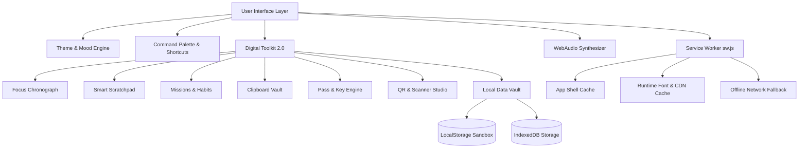

<div align="center">

# ⚡ Jino Sabu — Digital Architect & Productivity Hub

[](https://jinosabu1999.github.io/About-Me/)

<p align="center">
  <b>A futuristic developer portfolio paired with a 100% client-side, zero-cloud Progressive Web App (PWA) productivity suite.</b>
</p>

<!-- Dynamic Badges -->
<p align="center">
  <a href="https://jinosabu1999.github.io/About-Me/"></a>
  <a href="#-pwa--offline-first-architecture"></a>
  <a href="#-privacy--zero-cloud-guarantee"></a>
  <a href="LICENSE"></a>
  <a href="https://github.com/jinosabu1999/About-Me/stargazers"></a>
</p>

<!-- Quick Action Navigation Buttons -->
<p align="center">
  <a href="https://jinosabu1999.github.io/About-Me/"><b>🌐 Launch Web App</b></a> •
  <a href="#-built-in-toolkit-studio-9-apps-in-1"><b>⚡ Explore Tools</b></a> •
  <a href="#-pwa-installation-guide"><b>📱 Install PWA</b></a> •
  <a href="#-keyboard-shortcuts--command-palette"><b>⌨️ Shortcuts</b></a> •
  <a href="#-tech-stack--architecture"><b>🛠️ Architecture</b></a> •
  <a href="#-support--connect"><b>🤝 Connect</b></a>
</p>

---

</div>

## 📑 Table of Contents

- [🌟 Overview](#-overview)
- [⚡ Built-in Toolkit Studio (9 Apps in 1)](#-built-in-toolkit-studio-9-apps-in-1)
  - [1. 🍅 Focus Studio 2.0](#1--focus-studio-20)
  - [2. 📝 Smart Scratchpad](#2--smart-scratchpad)
  - [3. 🎯 Missions & Habits Hub](#3--missions--habits-hub)
  - [4. 📋 Smart Clipboard & Snippets](#4--smart-clipboard--snippets)
  - [5. 🔑 Passwords & Key Vault](#5--passwords--key-vault)
  - [6. ⏱️ Stopwatch Chronograph](#6-️-stopwatch-chronograph)
  - [7. 🔢 Multi-Counter Hub](#7--multi-counter-hub)
  - [8. 📷 Viewfinder & OCR Scanner](#8--viewfinder--ocr-scanner)
  - [9. 🔲 QR Code Studio](#9--qr-code-studio)
  - [10. 🛡️ Data Vault & Storage Telemetry](#10-️-data-vault--storage-telemetry)
- [📱 PWA & Offline-First Architecture](#-pwa--offline-first-architecture)
- [⌨️ Keyboard Shortcuts & Command Palette](#-keyboard-shortcuts--command-palette)
- [🎨 Dynamic Themes & Mood Presets](#-dynamic-themes--mood-presets)
- [🛠️ Tech Stack & Architecture](#-tech-stack--architecture)
- [🚀 Local Development & Deployment](#-local-development--deployment)
- [🤝 Support & Connect](#-support--connect)

---

## 🌟 Overview

**Jino Sabu | Digital Architect** is an all-in-one web platform built from the ground up to unite **personal branding, portfolio showcase, and an ultra-fast offline productivity hub** inside a single zero-dependency frontend experience.

### ✨ Highlights:
- **🚀 Zero Dependencies**: Engineered with vanilla ES6+ JavaScript, CSS3 Glassmorphism, and semantic HTML5. No bloated build frameworks or node runtimes required.
- **🛡️ 100% Client-Side Privacy**: All notes, tasks, passwords, clipboard history, and timer logs live strictly within your browser's encrypted sandbox. Zero remote servers, zero trackers.
- **📶 100% Offline Capable**: Backed by a high-performance Service Worker (`sw.js`) with cache fallback, stale-while-revalidate caching, and installable PWA manifest.
- **🔊 Native WebAudio Feedback**: Synthesized interactive haptic and audio feedback (clicks, swooshes, success chords, and timer chimes) without external sound files.

---

## ⚡ Built-in Toolkit Studio (9 Apps in 1)

Click on any module below to expand its full capability matrix and interactive preview:

<details open>
<summary><h3>1. 🍅 Focus Studio 2.0</h3></summary>

> **Deep work intervals, Pomodoro cycles, and flow states with smooth SVG chronograph animations.**

- **Preset Interval Modes**:
  - `Pomodoro`: 25m Focus / 5m Break (4 Rounds)
  - `Deep Work`: 50m Focus / 10m Break
  - `Flow State`: 90m Focus / 20m Break
  - `Sprint`: 15m Focus / 3m Break
  - `Custom`: Single-row custom interval configuration with dynamic scaling
- **Interactive Chronograph**:
  - Dynamic SVG radial progress ring with animated gradient stroke
  - `+1m`, `-1m`, and `+5m` quick extension buttons that scale progress in real time
  - Round indicators & optional Auto-Advance toggle
- **Telemetry & Daily History**:
  - Focus session logs categorized by activity tags (`#Code`, `#Design`, `#Writing`, `#Study`)
  - Streak tracker and weekly focus time chart

</details>

<details>
<summary><h3>2. 📝 Smart Scratchpad</h3></summary>

> **Private markdown notepad, code snippet manager, and document studio.**

- **Rich Formatting & Paragraph Freedom**: Unrestricted typing across headings, code blocks, blockquotes, images, numbered lists, and checklists.
- **Quick Templates**: One-click creation for *Meeting Notes, Personal Journal, Bug Reports, Checklists*, and *Brainstorms*.
- **Live Metadata HUD**: Real-time character count, word count, estimated reading duration, and auto-save indicators.
- **Collection Filters & Tag Chips**: Organize notes by folders and custom tags with debounced instant search.
- **PNG Card Generator**: Export notes into aesthetic social share cards with *Midnight, Paper,* or *Neon* presets.

</details>

<details>
<summary><h3>3. 🎯 Missions & Habits Hub</h3></summary>

> **Visual Kanban board and daily habit streak tracker.**

- **Interactive Kanban Board**: `To Do`, `In Progress`, and `Completed` columns with task prioritization and due dates.
- **Habit Matrix**: Daily habit check-offs with sequential streak tracking and completion percentage gauges.
- **Prominent Command Hub**: Quick task creation modal, filtering by status, and one-click clear options.

</details>

<details>
<summary><h3>4. 📋 Smart Clipboard & Snippets</h3></summary>

> **Intelligent text clipboard manager with pin support and auto-expiry hygiene.**

- **Smart Content Detection**: Automatically classifies text as `Code / JSON`, `URL Link`, `Email`, or `Text Note`.
- **Auto-Expiry Hygiene**: Set snippet expiry rules (*1 Hour, 24 Hours, 7 Days, Never*) to keep your workspace decluttered.
- **Batch Operations**: Bulk pin, copy, share, or delete clips with a single tap.
- **Cross-Tool Integration**: Send snippets directly to Scratchpad or generate QR codes instantly.

</details>

<details>
<summary><h3>5. 🔑 Passwords & Key Vault</h3></summary>

> **Cryptographically secure key generator and local encrypted vault.**

- **Configurable Entropy Engine**: Uppercase, lowercase, numbers, symbols, and ambiguous character filtering.
- **Length Control**: Slider with interactive fill progress line (up to 32 characters).
- **Entropy & Strength Telemetry**: Real-time crack-time estimates and strength ratings (Weak, Good, Strong, Military-grade).
- **Compact 3-Line Screen**: Mask/unmask toggle, copy-to-clipboard, and local password history vault.

</details>

<details>
<summary><h3>6. ⏱️ Stopwatch Chronograph</h3></summary>

> **Millisecond precision split timer and sprint tracker.**

- **Session Tagging**: Name individual sprint sessions for targeted tracking.
- **Lap & Split Comparison**: Logs split times with relative delta comparisons (`+0.42s`, `-0.18s`).
- **Data Export**: Export complete lap logs directly to CSV spreadsheet format.

</details>

<details>
<summary><h3>7. 🔢 Multi-Counter Hub</h3></summary>

> **Multi-tally counter studio for habits, reps, inventory, and milestones.**

- **Custom Increments**: Configure step values (+1, +5, +10, or custom), upper target limits, and initial values.
- **Color Coding**: Organize tallies with colored theme tags.
- **Milestone Alerts**: Haptic pulse and visual celebration upon reaching target milestones.

</details>

<details>
<summary><h3>8. 📷 Viewfinder & OCR Scanner</h3></summary>

> **Real-time camera scanner and file OCR engine.**

- **Camera Viewfinder**: Live camera feed with hardware camera toggle (front / back) and flashlight support.
- **QR & Barcode Decoder**: Instantly parses URLs, Wi-Fi credentials, and contacts from camera or image files.
- **Scan History Log**: Copy, share, or export recognized scan results.

</details>

<details>
<summary><h3>9. 🔲 QR Code Studio</h3></summary>

> **Vector QR generator with custom payloads and styling.**

- **Supported Formats**: URLs, Plain Text, Wi-Fi Networks (SSID + WPA password), and vCards.
- **Color Customization**: Dynamic foreground and background color pickers.
- **Export Formats**: High-resolution PNG download, clipboard copy, and native OS share dialog.

</details>

<details>
<summary><h3>10. 🛡️ Data Vault & Storage Telemetry</h3></summary>

> **Real-time storage quota telemetry and privacy management.**

- **Storage Meter**: Visual multi-segment breakdown of browser quota consumption (Notes, Clips, Tasks, Passwords).
- **Master JSON Backup**: One-click encrypted JSON backup and restore matrix.
- **Granular Hygiene**: Selectively reset individual modules or execute a complete factory wipe.

</details>

---

## 📱 PWA & Offline-First Architecture

This repository is a fully compliant **Progressive Web App (PWA)** that can be installed on any device:

```
├── manifest.json              # W3C Web App Manifest (standalone, theme colors, shortcuts)
├── sw.js                      # Production Service Worker (pre-cache shell + runtime caching)
├── browserconfig.xml          # Windows / Edge tile configuration
└── icons/                     # Complete icon suite (16px to 512px + Maskable Android icons)
```

### 📲 How to Install:

| Platform | Installation Steps |
|---|---|
| **iOS / iPadOS (Safari)** | Open site in Safari → Tap **Share** icon → Select **"Add to Home Screen"** |
| **Android (Chrome / Edge)** | Open site → Tap **"Install"** prompt badge or **Menu (⋮) → "Add to Home screen"** |
| **macOS / Windows / Linux** | Click the **Install** icon in the browser address bar (Chrome, Edge, Brave) |

### 🚀 Manifest Deep-Link Shortcuts:
Launch directly into specific tool views from your device's home screen icon long-press menu:
- `?app=notes` ➔ **Smart Scratchpad**
- `?app=focus` ➔ **Focus Studio**
- `?app=missions` ➔ **Missions & Kanban**
- `?app=clip` ➔ **Smart Clipboard**
- `?app=toolkit` ➔ **Digital Toolkit Launcher**

---

## ⌨️ Keyboard Shortcuts & Command Palette

Open the unified Command Palette from anywhere with <kbd>Cmd</kbd> + <kbd>K</kbd> or <kbd>Ctrl</kbd> + <kbd>K</kbd>:

```
┌─────────────────────────────────────────────────────────────┐
│  Search commands, notes, missions, clips (Cmd+K)...        │
└─────────────────────────────────────────────────────────────┘
```

| Key / Command | Action |
|---|---|
| <kbd>Cmd</kbd> + <kbd>K</kbd> / <kbd>Ctrl</kbd> + <kbd>K</kbd> | Toggle Command Palette |
| <kbd>N</kbd> | Create a new Note in Scratchpad |
| <kbd>T</kbd> | Create a new Task in Missions |
| <kbd>C</kbd> | Create a new Tally Counter |
| `[Math Expression]` | Instant inline math calculations (e.g. `24 * 7`, `1000 / 4`) |
| <kbd>Esc</kbd> | Close active sheet or modal |

---

## 🎨 Dynamic Themes & Mood Presets

Personalize the entire workspace with real-time CSS variable manipulation:

- **Theme Modes**: `Dark Mode` (Default obsidian) • `Light Mode` • `System Sync`
- **Mood Presets**:
  - 🟣 `Focus` — Deep midnight violet & calm indigo
  - 🟢 `Neon` — Cyberpunk emerald & electric cyan
  - ⚪ `Minimal` — High-contrast monochrome grayscale
  - 🟠 `Warm` — Cozy amber & sunset orange
  - 🟩 `Terminal` — Retro hacker phosphor green
  - 🔵 `Ocean` — Deep marine blue & aqua
- **Custom Accent Colors**: 10 selectable accent color swatches with dynamic glow shadows.
- **Accessibility Engine**: Toggle *Reduce Motion*, *High Contrast*, *Larger Text*, or *Mute Audio SFX*.

---

## 🛠️ Tech Stack & Architecture


```mermaid
graph TD
    A[User Interface Layer] --> B[Theme & Mood Engine]
    A --> C[Command Palette & Shortcuts]
    A --> D[Digital Toolkit 2.0]
    
    D --> E1[Focus Chronograph]
    D --> E2[Smart Scratchpad]
    D --> E3[Missions & Habits]
    D --> E4[Clipboard Vault]
    D --> E5[Pass & Key Engine]
    D --> E6[QR & Scanner Studio]
    
    A --> F[WebAudio Synthesizer]
    A --> G[Service Worker sw.js]
    
    G --> H1[App Shell Cache]
    G --> H2[Runtime Font & CDN Cache]
    G --> H3[Offline Network Fallback]
    
    D --> I[Local Data Vault]
    I --> J1[(LocalStorage Sandbox)]
    I --> J2[(IndexedDB Storage)]
```

- **Frontend**: Pure HTML5, CSS3 Variables, Glassmorphism, Vanilla ES6+
- **Offline Engine**: Service Worker API (`sw.js`), Web App Manifest (`manifest.json`)
- **Audio Synthesis**: Native WebAudio API (Zero MP3/WAV dependencies)
- **Data Layer**: Local-First Sandbox with Storage Quota Telemetry API
- **Vector Graphics**: Native SVG & Canvas API

---

## 🚀 Local Development & Deployment

### Run Locally (Zero Setup):
Because there are zero build steps, you can serve the project with any static HTTP server:

```bash
# Clone repository
git clone https://github.com/jinosabu1999/About-Me.git
cd About-Me

# Start a local web server (Python)
python3 -m http.server 8080

# Or with Node.js
npx serve .
```

Open your browser at `http://localhost:8080`.

### Deploy to GitHub Pages:
1. Push this repository to GitHub.
2. Go to **Settings** → **Pages**.
3. Under **Build and deployment**, set Source to **Deploy from a branch** (`main` / root `/`).
4. Your PWA will be live at `https://<username>.github.io/<repository-name>/`.

---

## 🤝 Support & Connect

If you found this project helpful or inspiring, consider giving it a ⭐️ star on GitHub!

<p align="center">
  <a href="https://ko-fi.com/jinosabu1999"></a>
  <a href="https://paypal.me/jinosabu"></a>
  <a href="https://github.com/jinosabu1999"></a>
  <a href="https://twitter.com/jinosabu1999"></a>
</p>

---

<div align="center">
  <sub>Designed & Engineered with precision by <b>Jino Sabu</b>. MIT License.</sub>
</div>
